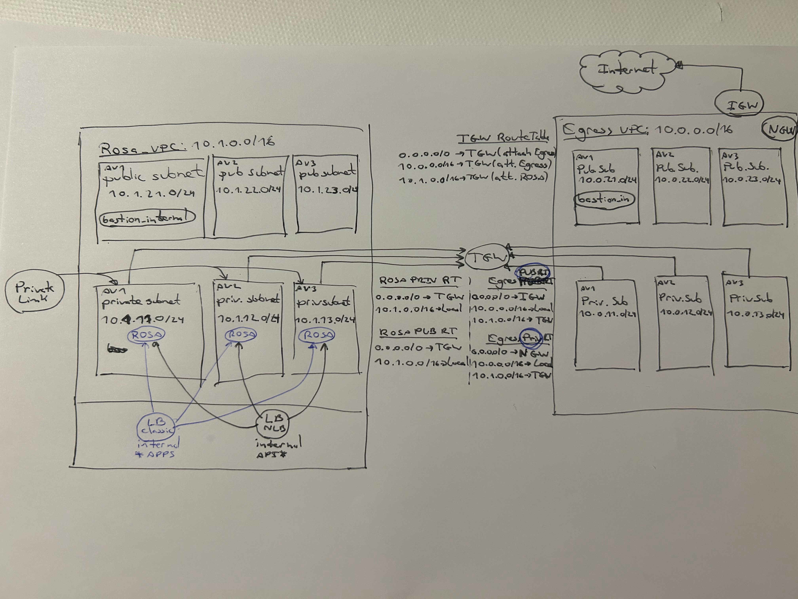

# ROSA w/ private link and STS

The code in this repo will create the necesary AWS resources required to deploy Red Hat OpenShift Service on AWS (ROSA) cluster using private link and Secure Token Service.
It will create the cluster in a 3 AZs.

This Terraform template will deploy a Hub and Spoke architecture, with an egress VPC. For internet access, the trafic will flow towards the egress VPC.
## Resources

### For the ROSA cluster
 * ROSA VPC
 * Private subnets only
 * Egress traffic is routed to the TGW.
 * Routing tables, rules and association for each subnet
 
### Hub - TGW
 * Attachments to the privete subnetworks

### Egress VPC
 * EGRESS VPC
 * Internet GW
 * EIP
 * NAT GW
 * Bastion Host1

## Diagram




## Prerequisites

 * The terraform AWS provider will need the user to be [authenticated](https://registry.terraform.io/providers/hashicorp/aws/latest/docs#authentication-and-configuration)
 * The terraform CLI
 * The ROSA CLI

## Deploy Environment
The infrastructure deployment is divided in two diferent phases. 
 * First phase: consists deploying Terraform plan to create the auxiliary infrastructure. By auxiliary infrasctructure I mean: the VPCs (rosa and egress), Transit GW, NAT GW, IGW, configure the Routing tables, etc... 

 * Second phase: Use the ROSA cmd cli to create the rosa cluster.

### Deploy Auxiliary Infrastructure - First Phase
1. Clone this repo
```
$ git clone https://github.com/CSA-RH/terraform-rosa.git
```

2. Go to path
```
cd terraform-rosa/roots/rosa_privatelink_sts_3azs
```

4. Rename the file terraform.tfvars.example to terraform.tfvars, and configure in the file the SSH public Key parameter
```
mv terraform.tfvars.example terraform.tfvars
vi terraform.tfvars
```

5. Deploy AWS resources
```
terraform init
terraform plan -out "rosa.plan"
terraform apply "rosa.plan"
```

## SSH into the bastion host and tunneling from your local host

1.Note the DNS of the OCP API
```
rosa describe cluster -c your_cluster | grep URL
API URL:                    https://api.rosa-test.xxxx.p1.openshiftapps.com:6443
Console URL:                https://console-openshift-console.apps.rosa-test.xxxx.p1.openshiftapps.com
```

2.Create a ROSA admin user and save the login command for use later
```
rosa create admin -c $CLUSTER_NAME
```

3.Configure the client hosts file
```
vi /etc/hosts

127.0.0.1 api.$YOUR_OPENSHIFT_DNS
127.0.0.1 console-openshift-console.apps.$YOUR_OPENSHIFT_DNS
127.0.0.1 oauth-openshift.apps.$YOUR_OPENSHIFT_DNS
```

4.Establish a SSH tunnel, Bastion_egress 
NOTE: prior this step you need to associate the private hosted zone with the egress vpc and then configure a route53 inbound endpoint, this enable the ROSA cluster names resolution from the egress VPC

client  ->  Bastion_egress -> OCP
```
export IP_BASTION_EGRESS=your_ip
export user=ec2-user

export YOUR_OPENSHIFT_DNS=rosa-test.xxxx.p1.openshiftapps.com 

# Tunnel from localhost to host1
sudo ssh -i testbox.pem -L 6443:api.$YOUR_OPENSHIFT_DNS:6443 -L 443:console-openshift-console.apps.$YOUR_OPENSHIFT_DNS:443 -L 80:console-openshift-console.apps.$YOUR_OPENSHIFT_DNS:80 ec2-user@$IP_BASTION_EGRES
```

5.Use oc cli command to interact with OCP cluster
Login with the output generated in step 2.
Example:
```
oc login https://api.<mydomain>:6443 --username cluster-admin --password <password>
```
